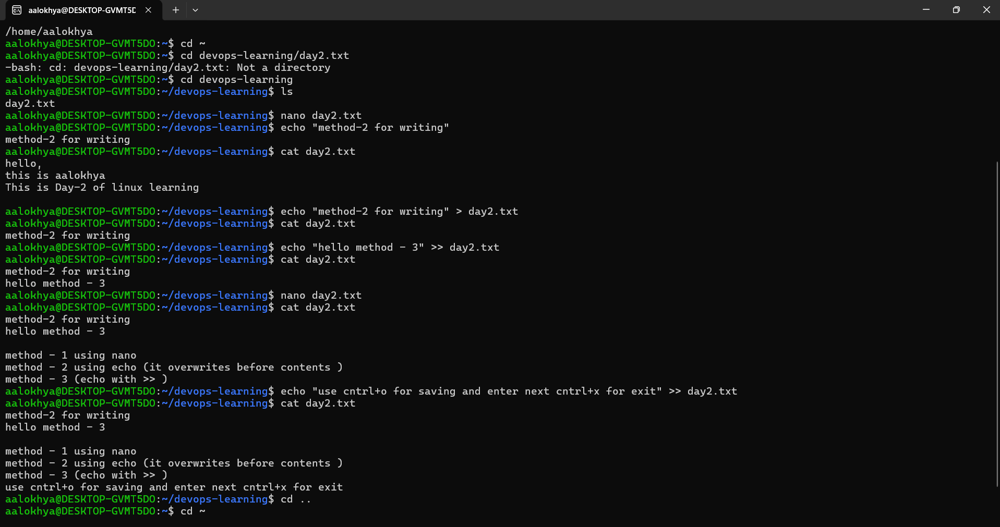

# 🐧 Day 2: Advanced Directory Navigation & File Mutation

## Key Commands Learned
* `cd ..` — Steps backward into the parent folder directory layout.
* `cd ~` — Jumps straight back to your primary user home folder directory.
* `touch filename.txt` — Instantly provisions a blank file within the active path.

## Practical Practice Done
I validated file writing mechanics on `day2.txt` using three distinct workflows:
1. **Method 1 (Nano Editor):** Interactively writing file payloads inside the console screen (`Ctrl+O` to save, `Ctrl+X` to exit).
2. **Method 2 (`>` Operator):** Overwriting entire text files instantly from the terminal via stream redirection (`echo "text" > file`).
3. **Method 3 (`>>` Operator):** Appending new text data directly to the bottom of the file without losing current history (`echo "text" >> file`).

## 📸 Proof of Output

